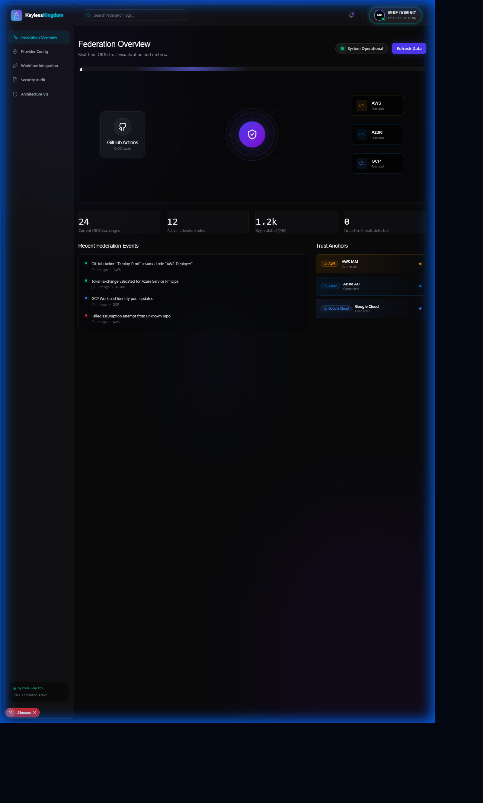
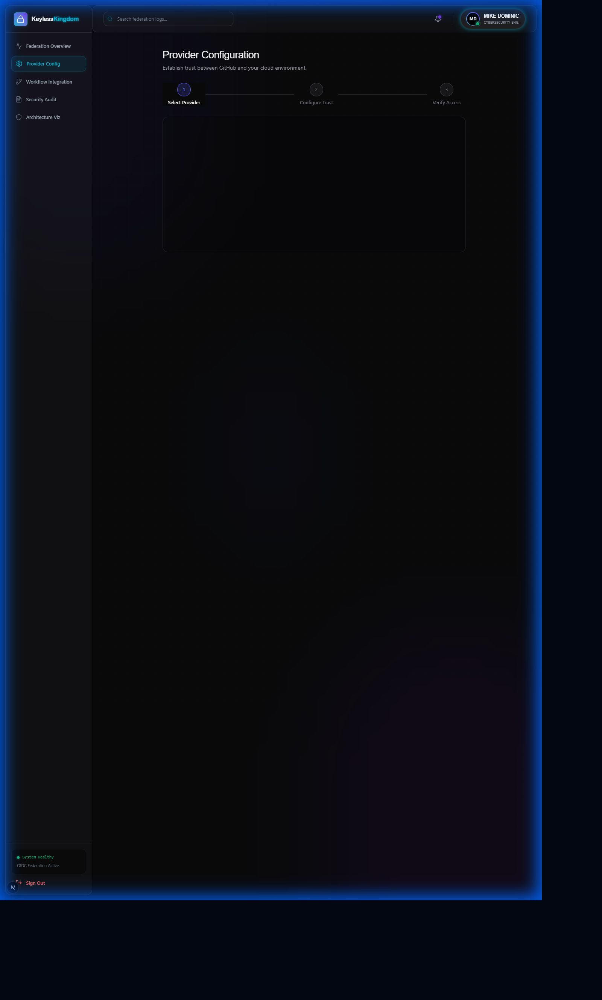
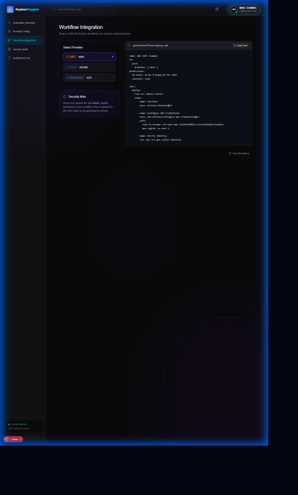
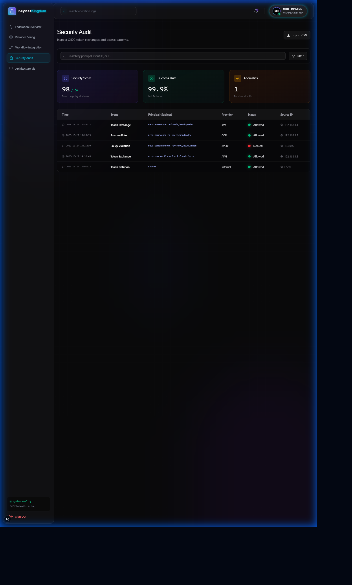
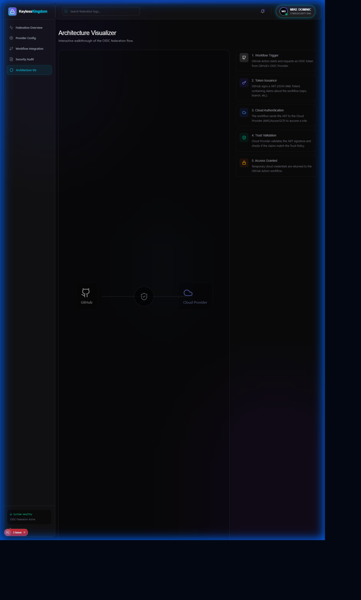

<p align="center">
  
</p>

<h1 align="center">Keyless Kingdom</h1>
<h3 align="center">Multi-Cloud Workload Identity Federation with Zero Secrets</h3>

<p align="center">
  
  
  
  
  
</p>

<p align="center">
  <strong>Production-ready workload identity federation across AWS, GCP, and Azure using OpenID Connect - eliminating long-lived credentials entirely</strong>
</p>

---

## The Problem

<table>
<tr>
<td width="50%">

### Long-Lived Credentials Are a Security Nightmare

Traditional CI/CD pipeline challenges:
- **Service account keys** leaked in git history
- **Access keys** rotated manually (or never)
- **Client secrets** stored in GitHub Secrets
- **Broad permissions** to accommodate multiple workflows

Security risks include:
- Credential exfiltration from CI/CD systems
- Audit trails that can't correlate to specific workflows
- Keys valid for months or years
- Manual rotation overhead

</td>
<td width="50%">

### What DevSecOps Teams Need

Modern Zero Trust CI/CD requires:
- **No stored credentials** anywhere
- **Short-lived tokens** issued on-demand
- **Fine-grained permissions** per workflow
- **Automatic token refresh** without rotation
- **Audit correlation** to specific repos/branches
- **Multi-cloud support** from single pipeline

**Workload Identity Federation solves all of this.**

</td>
</tr>
</table>

---

## The Solution: Keyless Kingdom

<p align="center">
  
</p>

Complete workload identity federation across all major cloud providers:

| Capability | Technology | Outcome |
|------------|------------|---------|
| **AWS Authentication** | OIDC Provider + IAM Roles | Short-lived STS tokens |
| **GCP Authentication** | Workload Identity Federation | Service account impersonation |
| **Azure Authentication** | Federated Identity Credentials | Managed identity tokens |
| **Infrastructure as Code** | Terraform Modules | Reproducible deployment |
| **CI/CD Integration** | GitHub Actions OIDC | Zero secrets in workflows |
| **Security Audit** | CloudTrail, GCP Logs, Azure Monitor | Complete audit trail |

---

## Screenshots

### Dashboard Views

<table>
<tr>
<td align="center" width="33%">

<br/><strong>Federation Dashboard</strong>
<br/>Royal dark stealth theme
</td>
<td align="center" width="33%">

<br/><strong>Provider Configuration</strong>
<br/>Multi-cloud setup
</td>
<td align="center" width="33%">

<br/><strong>Workflow Status</strong>
<br/>GitHub Actions integration
</td>
</tr>
</table>

### Additional Views

<table>
<tr>
<td align="center" width="50%">

<br/><strong>Security Audit</strong>
<br/>Cross-cloud audit logs
</td>
<td align="center" width="50%">

<br/><strong>Architecture View</strong>
<br/>Federation flow diagram
</td>
</tr>
</table>

---

## Why Workload Identity Federation?

<table>
<tr>
<td width="60%">

### The Security Rationale

Workload Identity Federation was chosen because:

1. **Zero Secrets** - No credentials stored anywhere
2. **Short-Lived Tokens** - Minutes, not months
3. **Fine-Grained Access** - Per workflow permissions
4. **Audit Correlation** - Logs show exact repo/branch/actor
5. **Multi-Cloud Native** - AWS, GCP, Azure all support OIDC

### Skills Demonstrated

- GitHub Actions OIDC token exchange
- AWS IAM OIDC Provider configuration
- GCP Workload Identity Pool setup
- Azure Federated Identity Credentials
- Terraform multi-cloud infrastructure

</td>
<td width="40%">

### Before vs After

| Metric | Traditional | Keyless |
|--------|-------------|---------|
| Stored Credentials | GitHub Secrets | **None** |
| Token Lifetime | Months/Years | **Minutes** |
| Rotation | Manual | **Automatic** |
| Permissions | Broad | **Fine-grained** |
| Audit Trail | Limited | **Complete** |

### Supported Providers

- AWS (OIDC Provider + IAM Roles)
- GCP (Workload Identity Federation)
- Azure (Federated Identity Credentials)
- GitHub Actions (OIDC Token Issuer)

</td>
</tr>
</table>

---

## Architecture

```
                              GITHUB ACTIONS OIDC
    ┌─────────────────────────────────────────────────────────────────┐
    │                                                                  │
    │  Workflow requests OIDC token from GitHub's Identity Provider   │
    │  Token includes: repo, branch, actor, environment, job_id       │
    │                                                                  │
    └─────────────────────────────┬───────────────────────────────────┘
                                  │
                                  │ JWT Token (signed by GitHub)
                                  │
            ┌─────────────────────┼─────────────────────┐
            │                     │                     │
            ▼                     ▼                     ▼
    ┌──────────────┐      ┌──────────────┐      ┌──────────────┐
    │     AWS      │      │     GCP      │      │    Azure     │
    │ OIDC Provider│      │  Workload    │      │  Federated   │
    │              │      │  Identity    │      │  Identity    │
    │ Validates    │      │  Pool        │      │  Credential  │
    │ JWT claims   │      │              │      │              │
    └──────┬───────┘      └──────┬───────┘      └──────┬───────┘
           │                     │                     │
           ▼                     ▼                     ▼
    ┌──────────────┐      ┌──────────────┐      ┌──────────────┐
    │   IAM Role   │      │   Service    │      │   Managed    │
    │              │      │   Account    │      │   Identity   │
    │ AssumeRole   │      │ Impersonate  │      │   Token      │
    │ WithWebIdent │      │              │      │              │
    └──────┬───────┘      └──────┬───────┘      └──────┬───────┘
           │                     │                     │
           └─────────────────────┼─────────────────────┘
                                 │
                                 ▼
    ┌─────────────────────────────────────────────────────────────────┐
    │                    CLOUD RESOURCES                               │
    │                                                                  │
    │  S3 Buckets    │    GCS Buckets    │    Azure Blob Storage      │
    │  EC2 Instances │    GCE Instances  │    Azure VMs               │
    │  Lambda        │    Cloud Functions│    Azure Functions         │
    │                                                                  │
    └─────────────────────────────────────────────────────────────────┘
```

---

## Quick Start

### Prerequisites
- Terraform >= 1.5.0
- AWS CLI, gcloud CLI, Azure CLI
- GitHub repository with Actions enabled

### AWS Setup

```bash
# Deploy OIDC provider and IAM role
cd terraform/aws
cp terraform.tfvars.example terraform.tfvars
terraform init && terraform apply

# Get role ARN for GitHub Actions
terraform output github_actions_role_arn
```

**GitHub Actions Workflow:**
```yaml
- name: Configure AWS credentials
  uses: aws-actions/configure-aws-credentials@v4
  with:
    role-to-assume: arn:aws:iam::ACCOUNT_ID:role/github-actions-role
    aws-region: us-east-1
```

### GCP Setup

```bash
# Deploy Workload Identity Pool
cd terraform/gcp
cp terraform.tfvars.example terraform.tfvars
terraform init && terraform apply

# Get provider for GitHub Actions
terraform output workload_identity_provider
```

**GitHub Actions Workflow:**
```yaml
- name: Authenticate to Google Cloud
  uses: google-github-actions/auth@v2
  with:
    workload_identity_provider: 'projects/PROJECT_NUMBER/locations/global/workloadIdentityPools/github-pool/providers/github-provider'
    service_account: 'github-actions@PROJECT_ID.iam.gserviceaccount.com'
```

### Azure Setup

```bash
# Deploy Federated Identity Credential
cd terraform/azure
cp terraform.tfvars.example terraform.tfvars
terraform init && terraform apply

# Get client and tenant IDs
terraform output client_id
terraform output tenant_id
```

**GitHub Actions Workflow:**
```yaml
- name: Azure Login
  uses: azure/login@v1
  with:
    client-id: ${{ secrets.AZURE_CLIENT_ID }}
    tenant-id: ${{ secrets.AZURE_TENANT_ID }}
    subscription-id: ${{ secrets.AZURE_SUBSCRIPTION_ID }}
```

---

## Use Cases

<table>
<tr>
<td width="50%">

### 1. Multi-Cloud Terraform Deployment

**Scenario**: Deploy infrastructure to AWS, GCP, and Azure from single pipeline.

**Implementation**:
- GitHub Actions requests OIDC token
- Each cloud validates token claims
- Short-lived credentials issued
- Terraform deploys to all three clouds

**Outcome**: Zero secrets in CI/CD, complete audit trail.

</td>
<td width="50%">

### 2. Container Image Push

**Scenario**: Build and push to ECR, GCR, and ACR.

**Implementation**:
- Authenticate to all three registries
- Build container image once
- Push to multi-cloud registries
- No registry credentials stored

**Outcome**: Multi-cloud container distribution.

</td>
</tr>
<tr>
<td width="50%">

### 3. Secrets Rotation Pipeline

**Scenario**: Rotate secrets across cloud providers.

**Implementation**:
- Pipeline authenticates via OIDC
- Access secrets managers in each cloud
- Rotate credentials programmatically
- No admin credentials in pipeline

**Outcome**: Automated secrets rotation.

</td>
<td width="50%">

### 4. Cross-Cloud Data Sync

**Scenario**: Sync data between S3, GCS, and Azure Blob.

**Implementation**:
- Authenticate to all storage services
- Read from source bucket
- Write to destination buckets
- Audit trail shows exact workflow

**Outcome**: Cross-cloud data replication.

</td>
</tr>
</table>

---

## Project Structure

```
keyless-kingdom/
├── terraform/
│   ├── aws/                # AWS OIDC Provider + IAM Roles
│   │   ├── main.tf
│   │   ├── variables.tf
│   │   └── outputs.tf
│   ├── gcp/                # GCP Workload Identity Federation
│   │   ├── main.tf
│   │   ├── variables.tf
│   │   └── outputs.tf
│   ├── azure/              # Azure Federated Identity Credentials
│   │   ├── main.tf
│   │   ├── variables.tf
│   │   └── outputs.tf
│   └── modules/            # Reusable Terraform modules
├── .github/workflows/      # GitHub Actions pipelines
│   ├── aws-deploy.yml
│   ├── gcp-deploy.yml
│   ├── azure-deploy.yml
│   └── multi-cloud.yml
├── frontend/               # React dashboard
├── docs/                   # Documentation
└── tests/                  # Validation scripts
```

---

## Security Comparison

| Aspect | Long-Lived Keys | Keyless Kingdom |
|--------|----------------|-----------------|
| **Credential Storage** | GitHub Secrets, Vault | None required |
| **Token Lifetime** | 90 days - Never expires | 1 hour maximum |
| **Rotation** | Manual process | Automatic per-job |
| **Blast Radius** | All workflows | Single job |
| **Audit Correlation** | Limited | Repo/branch/actor/job |
| **Exfiltration Risk** | High | Minimal |

---

## Skills Demonstrated

| Category | Technologies |
|----------|-------------|
| **Cloud Security** | OIDC Federation, Zero Trust, IAM |
| **AWS** | OIDC Provider, IAM Roles, STS |
| **GCP** | Workload Identity Pool, Service Accounts |
| **Azure** | Federated Identity, Managed Identity |
| **Infrastructure** | Terraform, Multi-Cloud IaC |
| **CI/CD** | GitHub Actions, OIDC Tokens |

---

## Troubleshooting

### AWS: "Not authorized to perform sts:AssumeRoleWithWebIdentity"

Verify trust policy matches your repository:
```json
"StringEquals": {
  "token.actions.githubusercontent.com:sub": "repo:MikeDominic92/keyless-kingdom:ref:refs/heads/main"
}
```

### GCP: "Permission 'iam.serviceAccounts.getAccessToken' denied"

Add workload identity binding:
```bash
gcloud iam service-accounts add-iam-policy-binding \
  github-actions@PROJECT_ID.iam.gserviceaccount.com \
  --role=roles/iam.workloadIdentityUser \
  --member="principalSet://iam.googleapis.com/projects/PROJECT_NUMBER/locations/global/workloadIdentityPools/github-pool/attribute.repository/MikeDominic92/keyless-kingdom"
```

### Azure: "AADSTS70021: No matching federated identity record found"

Check subject matches branch:
```
repo:MikeDominic92/keyless-kingdom:ref:refs/heads/main
```

---

## Roadmap

- [x] **v1.0**: AWS, GCP, Azure OIDC federation
- [ ] **v1.1**: GitLab CI/CD OIDC support
- [ ] **v1.2**: Bitbucket Pipelines integration
- [ ] **v1.3**: CircleCI OIDC support
- [ ] **v2.0**: Self-hosted runner federation

---

## Author

**Mike Dominic**
- GitHub: [@MikeDominic92](https://github.com/MikeDominic92)
- Focus: DevSecOps + Zero Trust CI/CD

---

<p align="center">
  <strong>Built with security in mind. No keys, no secrets, no compromises.</strong>
  <br/>
  <sub>This is a portfolio project demonstrating production-ready workload identity federation patterns.</sub>
</p>
