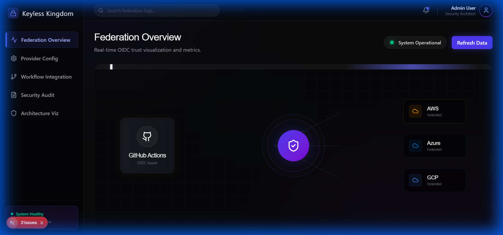
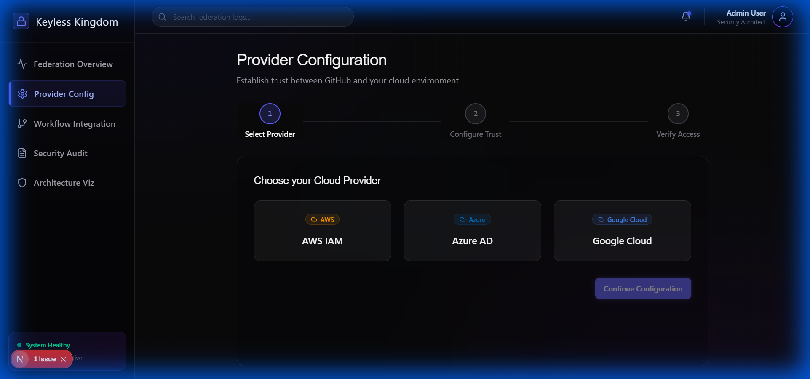
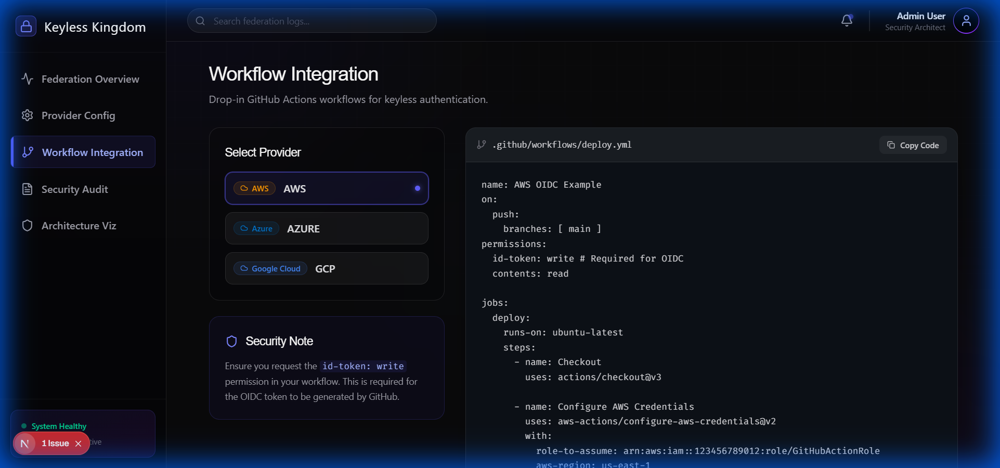
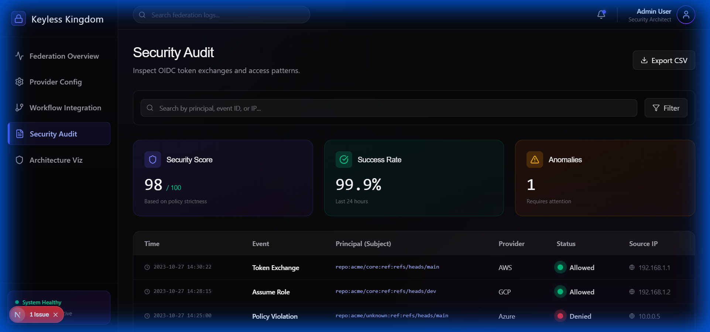
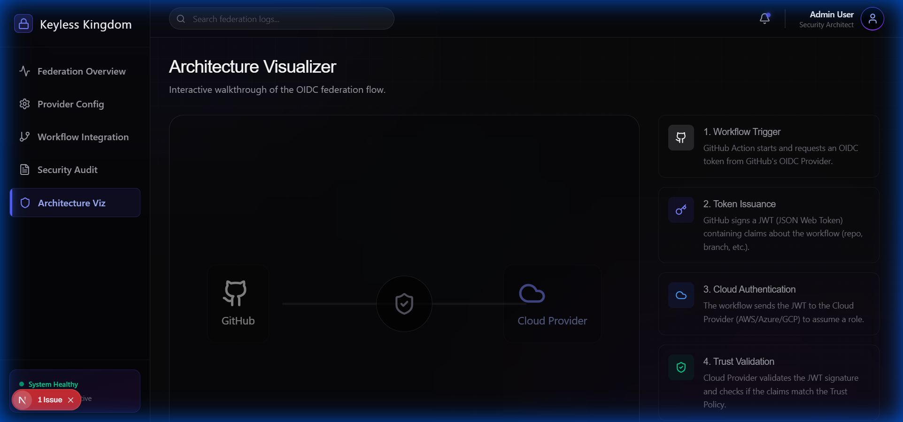

# Keyless Kingdom - Frontend Walkthrough

OIDC Federation dashboard for visualizing and managing passwordless cloud authentication between GitHub Actions and major cloud providers (AWS, Azure, GCP).

## Technology Stack

- **Framework**: Next.js 16 with App Router
- **Styling**: Tailwind CSS v4 with custom theme
- **Animations**: Framer Motion for trust flow visualizations
- **Charts**: Recharts for metrics
- **Icons**: Lucide React
- **Fonts**: Cal Sans (headers) + Inter (body) + Fira Code (code)

## Design System

### Color Palette
| Color | Hex | Usage |
|-------|-----|-------|
| Void Black | #09090B | Primary background |
| Obsidian | #18181B | Elevated surfaces |
| Royal Purple | #6366F1 | Primary accent, trust |
| Indigo | #4F46E5 | Secondary, connections |
| AWS Orange | #FF9900 | AWS provider accent |
| GCP Blue | #4285F4 | GCP provider accent |
| Azure Blue | #0078D4 | Azure provider accent |
| Emerald Glow | #10B981 | Success, verified |
| Amber Pulse | #F59E0B | Warnings |
| Ghost White | #FAFAFA | Primary text |

### Visual Effects
- Animated token flow lines between systems
- JWT decode animations with reveal effects
- Connection test pulse waves
- Provider cards with brand-colored glow on hover
- Trust bridge visualizations

## Screens

### 1. Federation Overview (Dashboard)
- Interactive federation map showing GitHub -> Cloud trust
- Trust status cards with live metrics
- Recent authentication timeline
- Active workflow indicators
- Status beacon for system health

### 2. Provider Configuration
- Cloud provider selection (AWS/GCP/Azure)
- Step-by-step setup wizard
- Trust policy JSON generator
- Configuration verification
- Troubleshooting accordion

### 3. Workflow Integration
- GitHub Actions YAML snippet generator
- Repository selector with multi-repo support
- Environment configuration (prod/staging/dev)
- Permission scope selector
- Copy-to-clipboard with animation

### 4. Security Audit
- Token exchange event log
- Security score and anomaly detection
- Filter by principal, event ID, IP
- Detailed JWT claims inspection
- Compliance status badges

### 5. Architecture Visualizer
- Step-by-step OIDC flow animation
- Interactive clickable components
- Educational explanations
- Export to SVG/PNG
- Old vs New (secrets vs keyless) comparison

## Screenshots

### Federation Dashboard


### Provider Configuration


### Workflow Integration


### Security Audit


### Architecture Visualizer


## Running the Frontend

```bash
cd frontend
npm install
npm run dev
```

Visit http://localhost:3000

## Build

```bash
npm run build
```

## Key Technical Features

- **Royal Dark Theme**: Custom Tailwind v4 with void black and purple accents
- **Framer Motion**: Smooth animations for federation map and trust flows
- **Code Generation**: Dynamic YAML/JSON snippets for each provider
- **Interactive Diagrams**: Clickable OIDC flow visualization

## Next Steps

- Connect to GitHub API for real repository data
- Integrate with AWS STS, GCP IAM, Azure AD for live verification
- Add token claims validation against configured policies
- Implement real-time WebSocket updates for active sessions
